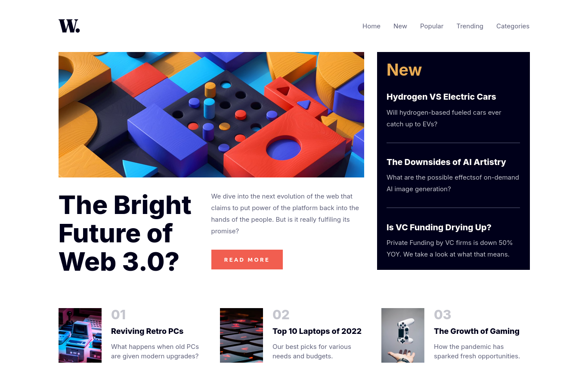

# Frontend Mentor - News homepage solution

This is a solution to the [News homepage challenge on Frontend Mentor](https://www.frontendmentor.io/challenges/news-homepage-H6SWTa1MFl). Frontend Mentor challenges help you improve your coding skills by building realistic projects.

## Table of contents

-   [Overview](#overview)
    -   [The challenge](#the-challenge)
    -   [Screenshot](#screenshot)
    -   [Links](#links)
-   [My process](#my-process)
    -   [Built with](#built-with)
    -   [What I learned](#what-i-learned)
    -   [Useful resources](#useful-resources)
-   [Author](#author)

## Overview

### The challenge

Users should be able to:

-   View the optimal layout for the interface depending on their device's screen size
-   See hover and focus states for all interactive elements on the page

### Screenshot



### Links

-   Solution URL: [Solution URL](https://github.com/Leroy-sama/news-homepage)
-   Live Site URL: [Live site URL](https://news-homepage-rouge.vercel.app/)

## My process

### Built with

-   Semantic HTML5 markup
-   CSS custom properties
-   Flexbox
-   CSS Grid
-   Mobile-first workflow

### What I learned

Use this section to recap over some of your major learnings while working through this project. Writing these out and providing code samples of areas you want to highlight is a great way to reinforce your own knowledge.

To see how you can add code snippets, see below:

```html
<picture>
	<source
		media="(min-width: 768px)"
		srcset="./assets/images/image-web-3-desktop.jpg"
	/>
	
</picture>
```

```css
.container {
	margin-inline: auto;
	width: min(90%, 73em);
}
```

### Useful resources

-   [Resource 1](https://youtu.be/HbBMp6yUXO0) - This helped me build the navbar. I really liked this pattern and will use it going forward.

## Author

-   Frontend Mentor - [@yourusername](https://www.frontendmentor.io/profile/Leroy-sama)
-   Twitter - [@mogire_leroy](https://x.com/mogire_leroy)
